Clean Code Yaklaşımı
-
Temiz kod; okunabilirliği, anlaşılırlığı ve bakımı kolay olan koddur. Aşağıda bu yaklaşımı daha iyi anlamak için bazı ilkeler ve bunlara ilişkin Java örnekleri bulabilirsiniz:

Anlamlı İsimlendirme: Değişkenler, sınıflar ve metodlar net bir şekilde isimlendirilmeli ve amacını veya işlevini belirtmelidir. Anlamlı isimlendirme, kodun okunmasını ve anlaşılmasını kolaylaştırır. Aynı zamanda, kodun ne yaptığına dair anlık bir fikir verir, böylece yorumlara daha az bağımlı oluruz.

Örneğin:

Kötü İsimlendirme

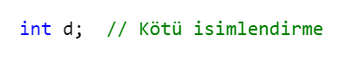

Bu örnekte 'd'nin ne anlama geldiğini anlamak zor. Bunun yerine, değişkenin neyi temsil ettiğini belirten bir isim kullanmalıyız.

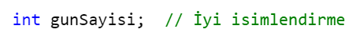

Kötü İsimlendirme:

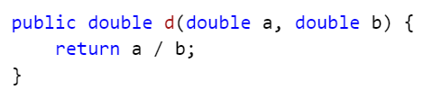

İyi İsimlendirme:

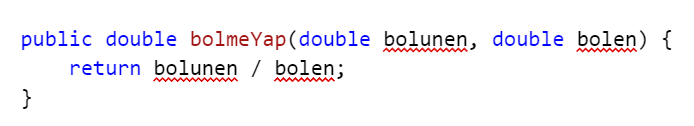

Fonksiyonlar Tek Görevli Olmalı: Bir fonksiyon ideal olarak sadece bir işlevi olmalı. Bu, kodun okunabilirliğini ve bakımını kolaylaştırır.

Örneğin;

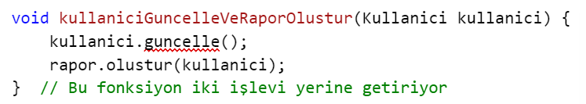

Bu fonksiyon iki farklı işlevi yerine getiriyor, bu yüzden yerine aşağıdakine benzer iki ayrı fonksiyon oluşturmalıyız:

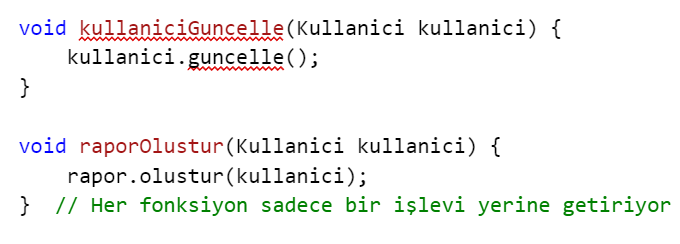

Tek Sorumluluk İlkesi: Bir metot ya da sınıf, sadece bir işlemi gerçekleştirmelidir. Bu, kodun okunabilirliğini ve bakımını kolaylaştırır.

Örneğin:

Kötü Uygulama:

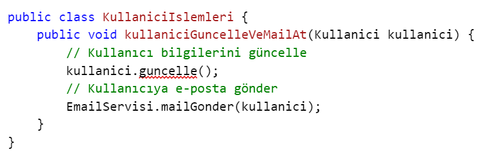

İyi Uygulama:

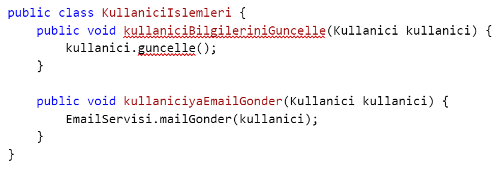

Kendini Açıklayan Kod: Mümkün olduğunda, kodun ne yaptığını açıklamak için yorum kullanmak yerine, kodun kendisinin anlaşılabilir olması hedeflenmelidir. İyi bir kod, genellikle ne yaptığını açıklamak için yorumlara ihtiyaç duymaz. Yorumları, karmaşık bir algoritmanın nasıl çalıştığını açıklamak veya TODO yorumları eklemek için kullanabiliriz, ancak genellikle kodun kendisi anlaşılır olmalıdır.

Örneğin;

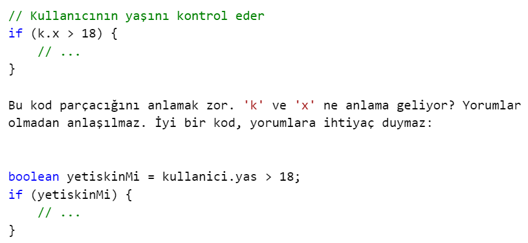

Örneğin:

Yorum Kullanımı:

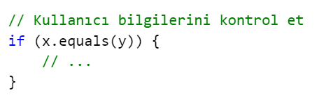

Yorum yerine Anlamlı Kod:

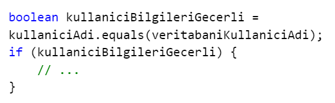

Hata Yakalama (Exception Handling): Hataların doğru bir şekilde yakalanması ve uygun hata mesajlarının verilmesi önemlidir. Bu, sorunları belirlemeyi ve çözmeyi kolaylaştırır.

Örneğin:

Kötü Uygulama:

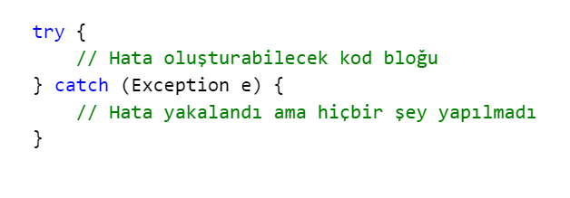

İyi Uygulama:

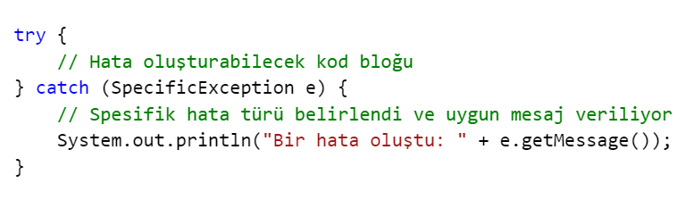

Kısa İfadeler Kullanma: Karmaşık ifadeler yerine daha basit ve kısa ifadeler kullanılmalıdır.

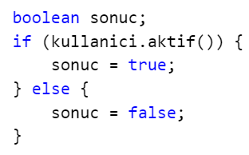

Bu kod parçacığı gereksiz yere karmaşıktır. Aşağıdaki gibi basitleştirilebilir:

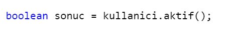

Kod Tekrarını Azaltma (DRY - Don't Repeat Yourself): Aynı kod bloklarının tekrar tekrar yazılması yerine, ortak işlevlilikleri fonksiyonlara veya sınıflara çıkarın.

Örneğin;

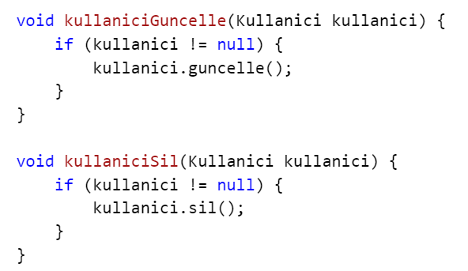

Yukarıdaki kod parçacığında, 'kullanici != null' kontrolü tekrarlanır. Bunu bir metotda birleştirebiliriz:

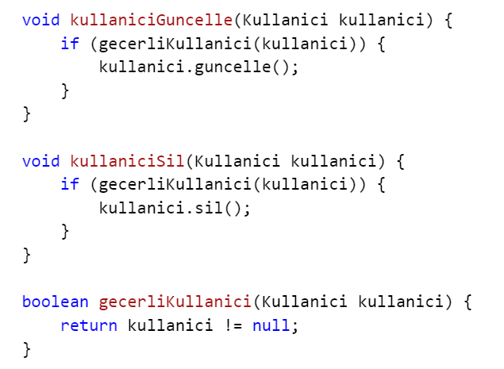

Bu ve bunun gibi birçok ilke, temiz kod yazma yaklaşımını oluşturur. Temiz kod, uzun vadede daha az hata, daha kolay bakım ve genel olarak daha yüksek kaliteli yazılımlar anlamına gelir. Her yeni başlayan yazılımcının, bu ilkeleri öğrenmesi ve uygulaması, kariyerlerinde büyük bir fark yaratabilir.

Bazı terimler size yabancı geliyor olabilir. Şu an bu ilkeleri sözel olarak bilmeniz yeterli. Programlamada biraz daha ilerlediğinizde bu prensipleri kullanmaya başlayabilirsiniz ve bu sayfaya tekrar göz atabilirsiniz. 
