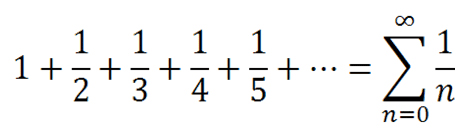

Dizideki sayıların harmonik ortalamasını hesaplayan programı 
-
Ödev
-
Dizideki sayıların harmonik ortalamasını hesaplayan programı yazınız.

Harmonik Ortalama formülü : n (eleman sayısı) / elemanların harmonik serisi

Harmonik Seri Formülü :

